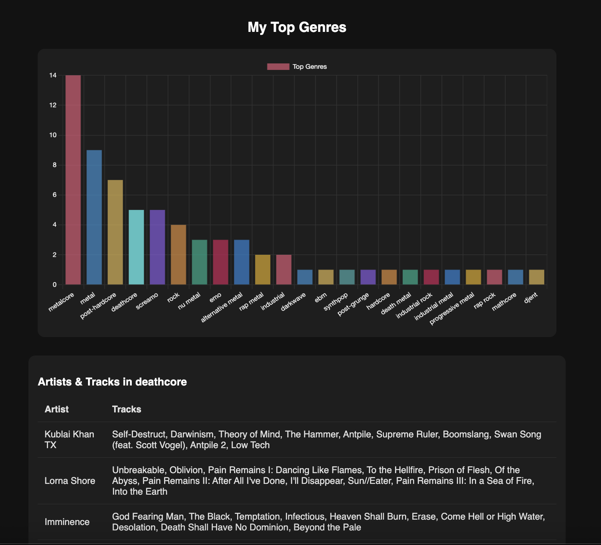
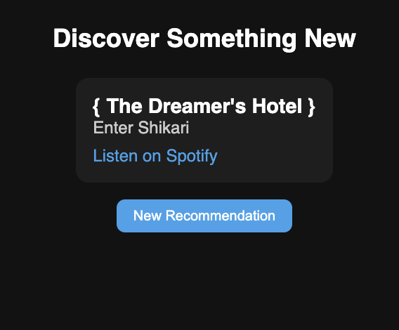
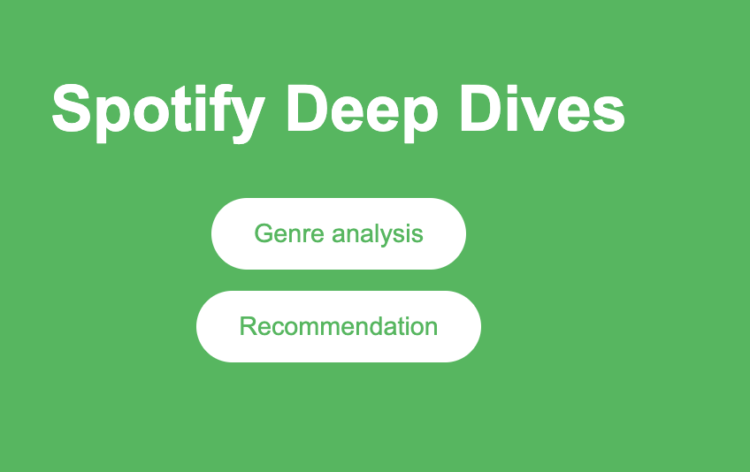

# Spotify Deep Dives

**Spotify Deep Dives** is a small app I'm building to practice Rust.

## Requirements

You’ll need to have Rust installed. If you don’t have it yet, you can follow the instructions here: [https://www.rust-lang.org/tools/install](https://www.rust-lang.org/tools/install)

You'll also need to generate your own spotify bearer token from [here](https://developer.spotify.com/) and add to a .env file

## Running the App

1. Clone this repository (if applicable).
2. Open a terminal in the project directory.
3. Run the app with:

```bash
cargo run
```

Genre analysis:


Recommendation generator:


Homepage:

